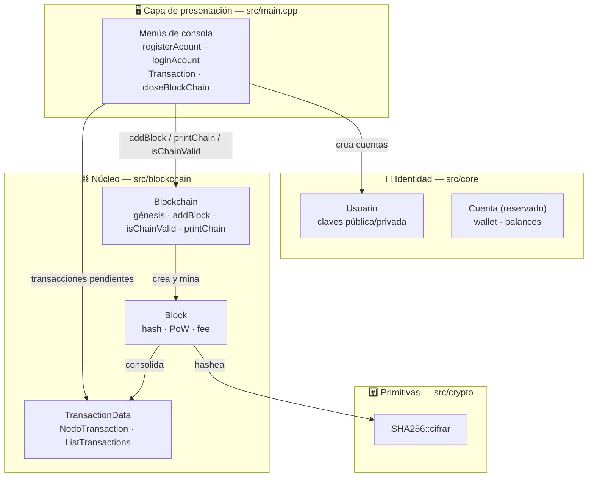
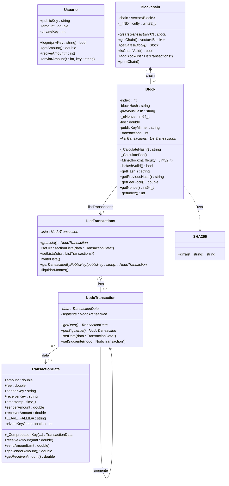
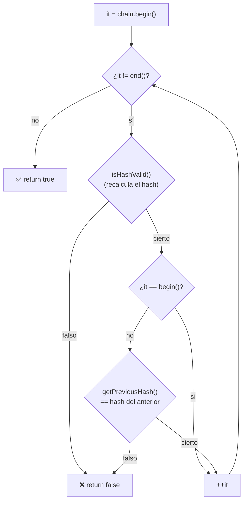
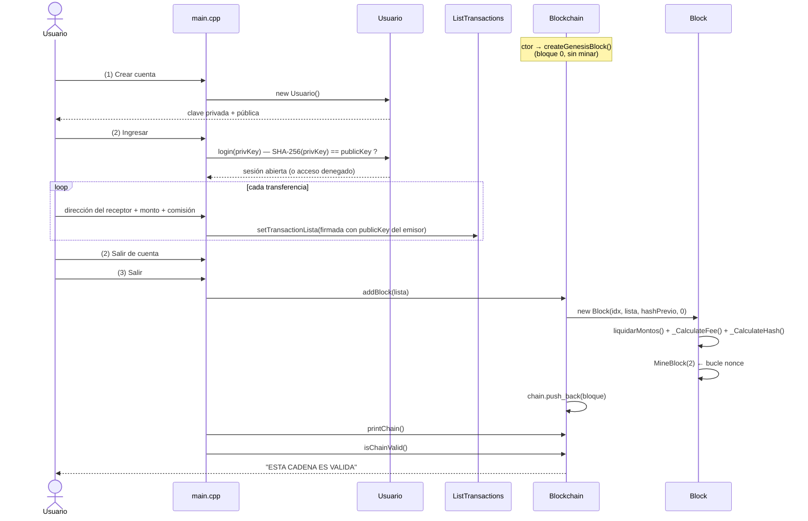
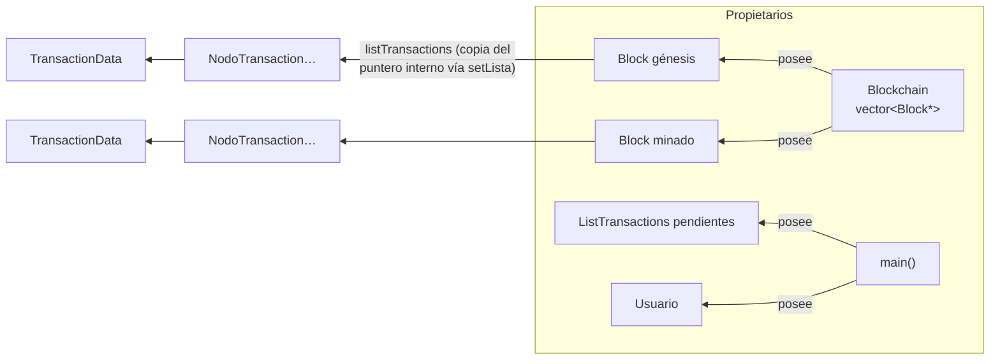

# 📘 Arquitectura de AwesomeCoin

Documentación técnica de la arquitectura interna del proyecto. Para instalación y uso rápido, ver el [README principal](../README.md).

## Índice

1. [Visión general](#1-visión-general)
2. [Diagrama de capas](#2-diagrama-de-capas)
3. [Diagrama de clases](#3-diagrama-de-clases)
4. [Módulos en detalle](#4-módulos-en-detalle)
5. [Pipeline de hashing](#5-pipeline-de-hashing)
6. [Prueba de trabajo (PoW)](#6-prueba-de-trabajo-pow)
7. [Validación de la cadena](#7-validación-de-la-cadena)
8. [Flujo de ejecución](#8-flujo-de-ejecución)
9. [Modelo de memoria y propiedad](#9-modelo-de-memoria-y-propiedad)
10. [Complejidad algorítmica](#10-complejidad-algorítmica)
11. [Decisiones de diseño y trade-offs](#11-decisiones-de-diseño-y-trade-offs)
12. [Seguridad: modelo de amenazas](#12-seguridad-modelo-de-amenazas)
13. [Limitaciones conocidas](#13-limitaciones-conocidas)
14. [Portabilidad](#14-portabilidad)

---

## 1. Visión general

AwesomeCoin es una blockchain educativa de **un solo nodo**, **en memoria** y con **interfaz de consola**. El sistema se compone de cuatro capas con dependencias unidireccionales:

| Capa | Ubicación | Responsabilidad |
|---|---|---|
| Presentación | `src/main.cpp` | Menús de consola, sesión de usuario, lectura validada de datos, cierre de la cadena |
| Identidad | `src/core/` | Claves, sesión y saldo del usuario (`Usuario`) y cartera (`Cuenta`) |
| Núcleo blockchain | `src/blockchain/` | Cadena (`Blockchain`), bloques (`Block`), transacciones (`TransactionData`, `ListTransactions`) |
| Primitivas cripto | `src/crypto/sha256.h` | Función hash SHA-256 implementada desde cero (educativa) |

**Paradigma:** C++ imperativo/orientado a objetos con punteros crudos y listas enlazadas escritas a mano (decisión didáctica). No hay excepciones, hilos, red ni persistencia.

## 2. Diagrama de capas



> La dependencia es estrictamente **hacia abajo**: `main → core/blockchain → crypto`. Ningún módulo inferior conoce a los superiores.

## 3. Diagrama de clases



> `Usuario` se conecta al núcleo desde la CLI: la sesión (`login` por clave privada) firma las transferencias con su clave pública; los balances on-chain los liquida el bloque al minar. La cartera (`Cuenta`) expone los saldos por dirección.

## 4. Módulos en detalle

### 4.1 `src/main.cpp` — Capa de presentación

Programa interactivo con funciones libres que orquestan la sesión:

| Función | Descripción |
|---|---|
| `main()` | Crea la `Blockchain` (instancia el génesis), la lista de pendientes y entra en el bucle de menú. Al salir (`opción 3`) llama `closeBlockChain()`. |
| `ingresoCuenta()` / `inAcoint()` | Pintan los menús principal y de cuenta; leen la opción en la variable global `orden`. |
| `registerAcount()` | Fábrica: `new Usuario()` (muestra claves por consola). |
| `loginAcount()` | Bucle del submenú de transacciones hasta pulsar `2`. |
| `Transaction()` | Lee monto + fee, crea la `TransactionData` vía `_ComprobationKey` (estático) y la apila en la lista de pendientes. |
| `closeBlockChain()` | Consolida pendientes en un bloque (`addBlock` → PoW), imprime la cadena y reporta `isChainValid()`. |
| `limpiarPantalla()` / `pausar()` | Utilidades portables: `cls`/`clear` según `_WIN32`, y pausa ENTER sin `conio.h`. |

**Entrada robusta:** tras cada iteración del menú se aplica `cin.clear()` + `cin.ignore(numeric_limits<streamsize>::max(), '\n')`, de modo que una letra donde se esperaba un número no deja el stream en estado de error (antes colgaba el menú en bucle).

### 4.2 `src/blockchain/Blockchain.{h,cpp}` — La cadena

| Método | Descripción |
|---|---|
| `Blockchain()` (ctor) | Crea y encola el **bloque génesis** (índice 0, `previousHash = "0"`, transacción `Genesis→Genesis` con monto 0) y fija `_nNDifficulty = 2`. |
| `createGenesisBlock()` (privado) | Construye el bloque inicial con una transacción simbólica. |
| `addBlock(ListTransactions*)` | Toma el hash del último bloque como `previousHash`, crea el bloque con las transacciones pendientes y llama a `MineBlock(_nNDifficulty)` antes de añadirlo al vector. |
| `isChainValid()` | Doble validación por bloque: (1) hash interno correcto, (2) `previousHash` coincide con el hash del bloque anterior. Ver [§7](#7-validación-de-la-cadena). |
| `printChain()` | Vuelca todos los campos de cada bloque; omite la escritura de transacciones en el génesis (`senderKey == "Genesis"`). |
| `getChain()` / `getLatestBlock()` | Accesores: copia del vector y `chain.back()`. |

> El bloque génesis **no se mina** (se crea con nonce 0 y su hash calculado directamente); solo los bloques añadidos con `addBlock` pasan por PoW.

### 4.3 `src/blockchain/Block.{h,cpp}` — El bloque

| Método | Descripción |
|---|---|
| `Block(idx, list, prevHash, nonce)` (ctor) | Copia la lista de transacciones, fija índice/nonce/hash previo, **liquida los montos** de sus transacciones (`liquidarMontos`), calcula **fee** (solo transacciones con firma válida; las marcadas `LLAVE_FALLIDA` no abonan comisión) y **hash** (en ese orden: el hash incluye el fee). |
| `_CalculateFee()` (privado) | Recorre la lista sumando `TransactionData::fee` → `Block::fee`. |
| `_CalculateHash()` (privado) | Pipeline de hashing; ver [§5](#5-pipeline-de-hashing). |
| `MineBlock(nDifficulty)` | PoW: incrementa `_nNonce` y recalcula el hash hasta que el prefijo hexadecimal sea `nDifficulty` ceros. Ver [§6](#6-prueba-de-trabajo-pow). |
| `isHashValid()` | `true` si recalcular el hash reproduce el `blockHash` almacenado. |
| Accesores | `getHash`, `getPreviousHash`, `getIndex`, `getNonce`, `getFeeBlock`. |

Miembros públicos por diseño didáctico: `transactions` (contador de bloques minados) y `listTransactions` (la lista consolidada).

### 4.4 `src/blockchain/TransactionData.h` — Transacciones y lista

Cabecera única con tres tipos:

- **`TransactionData`** — datos de la transacción: `amount`, `fee`, `senderKey`, `receiverKey`, `timestamp`, **saldos liquidados** (`senderAmount`/`receiverAmount`) y campo privado `privateKeyComprobation`. Su constructor es privado; la **fábrica estática** `_ComprobationKey(...)` es la única vía de instanciación y **valida la firma** de la clave privada contra la clave pública del emisor: con verificación fallida (pKyComprobation = 0) la transacción se emite con `senderKey = LLAVE_FALLIDA` (`"[FIRMA_INVALIDA]"`) — sigue encadenada (la integridad de la cadena manda) pero sin comisión ni abono. Métodos de balances: `receiveAmount`/`sendAmount`/`getSenderAmount`/`getReceiverAmount`.
- **`NodoTransaction`** — nodo de lista enlazada: envuelve `TransactionData*` y puntero `siguiente`, con getters protegidos contra `NULL`.
- **`ListTransactions`** — la lista enlazada en sí (inserción por cabeza → **orden LIFO**): `setTransactionLista` apila, `writeLista` imprime todas las transacciones (incluidos los saldos liquidados), `getTransactionByPublicKey` devuelve el primer nodo que envía o recibe esa clave y **`liquidarMontos()` efectúa el intercambio de montos** (débito del emisor + crédito del receptor) — la invoca el bloque al minar.

### 4.5 `src/core/Usuario.{h,cpp}` — Identidad y sesión

El constructor genera una **clave privada aleatoria de 6 dígitos** (`100000 + rand() % 900000`, sembrada con `srand(time(nullptr))`) y deriva la **clave pública** con **SHA-256** — la dirección on-chain del usuario. Ambas se muestran por consola una única vez.

- **`login(privKey)`**: abre la sesión derivando la clave privada por SHA-256 y comparando con la pública; una clave incorrecta no da acceso a la cartera (y sin sesión las transferencias se consignarían con firma inválida).
- **`getAmount()` / `reciveAmount()` / `enviarAmount()`**: saldo de la cartera y primitivas de débito/crédito (los intercambios on-chain ocurren al minar, en `Block`).

### 4.6 `src/crypto/sha256.h` — SHA-256 educativo

Implementación autónoma (constantes `K[64]`, IV `H_INICIAL`, macros `SR`, `Ch`, `Maj`, `s0/s1`, `o0/o1`):

1. Convierte el mensaje a **cadena binaria ASCII** (`msg2bin`) y añade el bit `1`.
2. **Padding**: rellena con `0` hasta `longitud % 512 == 448` y añade la longitud original en 64 bits.
3. Divide en bloques de 512 bits → 16 palabras de 32 bits (`M`).
4. **Expansión** a 64 palabras (`o1`, `o0`) y **64 rondas de compresión** con las constantes K.
5. Suma los registros al estado `H[8]` y concatena los 8 valores en hexadecimal → **64 caracteres**.

> Implementación **didáctica** (bits representados como texto): correcta como ejercicio, pero órdenes de magnitud más lenta y sin resistencia a side-channels. Para producción, usar OpenSSL o similar.

### 4.7 `src/core/Cuenta.h` — Cartera

Wallet de saldo por dirección, construida con **constructor privado + factories estáticas** (mismo patrón que `TransactionData`):

- **`crear(privKey, publicKey)`**: punto de entrada de carteras al registrarse; valida que la clave privada derive por SHA-256 en la clave pública. Devuelve `NULL` si la clave no corresponde.
- **`cargar(publicKey, amt)`**: consulta de saldo de una dirección conocida (explorador/persistencia futura).
- **`walletAddress(publicKey)`**: la dirección on-chain de una cartera es su clave pública.
- **`getBalance()` / `receive()`**: saldo y acreditación; el débito ocurre on-chain al minar (`Block`).

## 5. Pipeline de hashing

El hash de un bloque se calcula sobre esta concatenación exacta:

```
SHA-256( previousHash + Σ transacciones + fee + nonce )

donde la concatenación interna es:
    previousHash
    para cada transacción (desde la cabeza de la lista):
        amount (to_string double) + receiverKey + senderKey + timestamp (to_string)
    se añade al final:
        fee (to_string double) + nonce (to_string int64)
```

```mermaid
flowchart LR
    E[\"previousHash\"] --> B
    A[\"Transacciones<br/>amount+receiver+sender+ts\"] --> B[\"stringstream<br/>+ fee + nonce\"]
    B --> C[\"toHashS<br/>(string de datos)\"]
    C --> I[\"SHA256::cifrar<br/>(implementación propia)\"]
    I --> J[\"blockHash<br/>64 hex\"]
```

**Propiedades resultantes:**

- **Hashing directo**: el bloque se hashea con **SHA-256 puro** sobre `previousHash + datos` — sin etapas intermedias. El antiguo paso con `std::hash<std::string>` (no especificado por el estándar, distinto entre libstdc++/MSVC/libc++) fue eliminado, así que **los hashes son portables entre plataformas**: una cadena volcada desde Windows valida igual en Linux.
- **Efecto avalancha**: cualquier cambio en monto, clave, fee o nonce produce un hash completamente distinto → detecta manipulación.
- **Encadenado**: `previousHash` entra como prefijo de la mezcla, así que alterar un bloque invalida **todos** los siguientes (ver [§13](#13-limitaciones-conocidas)).

## 6. Prueba de trabajo (PoW)

`MineBlock(nDifficulty)` implementa un consenso simplificado tipo Bitcoin:

```cpp
objetivo = "00...0"                        // nDifficulty ceros
do {
    _nNonce += 1;                          // variar la entrada
    blockHash = _CalculateHash();          // recalcular
} while (blockHash.substr(0, nDifficulty) != objetivo);   // prefijo hex
```

| Aspecto | Valor |
|---|---|
| Dificultad actual | `_nNDifficulty = 2` → el hash debe empezar por `00` |
| Espacio de búsqueda | 16² = 256 hashes en media (~128 por paradoja del cumpleaños) |
| Coste observado | En pruebas: nonce 18 y nonce 3 (variabilidad normal del azar) |
| Verificación | Trivial: un `_CalculateHash()` + comparación de prefijo (asimetría clásica de PoW) |

**Propiedades:** el nonce es de 64 bits, así que el espacio de búsqueda es enorme y el minado siempre termina. Subir la dificultad a 3 (~4096 intentos) o 4 (~65 536) ralentiza el trabajo de forma perceptible, modelando el ajuste de dificultad de redes reales.

## 7. Validación de la cadena

`Blockchain::isChainValid()` recorre la cadena y aplica **dos comprobaciones por bloque**:

1. **Integridad interna** — `Block::isHashValid()`: recalcular el hash del contenido reproduce el hash almacenado. Detecta cualquier **mutación de datos** (monto, claves, fee, nonce…).
2. **Continuidad del encadenado** — para todo bloque salvo el primero: `currentBlock->getPreviousHash() == previousBlock->getHash()`. Detecta **sustitución o reordenación de bloques**.



**Garantía:** como el `previousHash` de cada bloque depende del hash del anterior, y ese hash cubre los datos, encadenar ambas comprobaciones hace que **cualquier alteración en un bloque cualquiera invalide la cadena desde ese punto hasta el final** — exactamente la propiedad de inmutabilidad que da nombre a la tecnología.

**Límite del modelo:** la validación verifica integridad estructural, pero **no autenticidad** (que el emisor tuviera fondos o autoridad para firmar). Eso llegará con el sistema de balances/firmas del roadmap.

## 8. Flujo de ejecución



**Puntos clave del flujo:**

- La cadena y el génesis existen **desde el arranque** de `main`; las cuentas son independientes de ella.
- Las transferencias solo **se acumulan** en memoria mientras la sesión está abierta; se consolidan en un único bloque al salir.
- Si no se registró ninguna transferencia, `addBlock` mina y consolida igualmente un bloque con lista vacía (fee 0).

## 9. Modelo de memoria y propiedad

Todo el grafo se construye con **punteros crudos** (`new`) sin liberación explícita (decisión didáctica: la vida útil coincide con la del proceso):



| Recurso | Propietario efectivo | Momento de creación | Liberación |
|---|---|---|---|
| `Block*` (génesis y minados) | `Blockchain::chain` | ctor de `Blockchain` / `addBlock` | Fin del proceso |
| `ListTransactions*` pendientes | `main()` | inicio de `main` | Fin del proceso |
| `NodoTransaction*` | la `ListTransactions` contenedora | `setTransactionLista` / copia en `Block` | Fin del proceso |
| `TransactionData*` | su `NodoTransaction` | `_ComprobationKey` (fábrica estática) | Fin del proceso |
| `Usuario*` | `main()` (`miCuenta`) | `registerAcount` | Fin del proceso |

**Detalles importantes:**

- `Block(idx, list, …)` llama a `listTransactions->setLista(list)`, que **copiará el puntero de la cabeza** de la lista origen; el bloque no clona los nodos. Tras `addBlock`, la lista pendiente y la del bloque comparten los mismos nodos — inofensivo aquí porque nadie los libera ni modifica después, pero relevante si se añadiera destrucción.
- La lista es **LIFO**: `writeLista` imprime la última transferencia primero.
- Al asignar memoria y no liberar, los analizadores reportarán "leaks" al terminar; en este diseño es equivalente a dejar que el SO reclaim la memoria al salir. El paso a `std::unique_ptr`/`std::shared_ptr` está en el roadmap.

## 10. Complejidad algorítmica

Sea *T* = transacciones por bloque, *B* = bloques en la cadena, *D* = dificultad PoW (en bits de prefijo):

| Operación | Complejidad | Notas |
|---|---|---|
| `ListTransactions::setTransactionLista` | O(1) | Inserción por cabeza |
| `Block::_CalculateFee` | O(T) | Un recorrido de la lista |
| `Block::_CalculateHash` | O(T · L + C) | *L* = longitud media de claves; *C* = coste de SHA-256 (implementación didáctica, dominado por el manejo de bits como texto) |
| `Block::MineBlock` | O(D · 16^D · C) en media | ~128 hashes con D=2 |
| `Blockchain::addBlock` | O(T·L + 16^D · C) | Dominado por el minado |
| `Blockchain::isChainValid` | O(B · (T·L + C)) | Recalcula el hash de **todos** los bloques |
| `Blockchain::printChain` | O(B · T) | Impresión |
| `ListTransactions::getTransactionByPublicKey` | O(T · L) | Búsqueda lineal, devuelve la primera coincidencia |

En la práctica, con dificultad 2 y listas pequeñas, todo es instantáneo. El cuello de botella real es el minado y, sobre todo, la implementación educativa de SHA-256 (miles de veces más lenta que una nativa).

## 11. Decisiones de diseño y trade-offs

| Decisión | Motivo | Trade-off asumido |
|---|---|---|
| Listas enlazadas a mano (`NodoTransaction`) | Práctica académica de estructuras de datos | Más código y riesgo de fugas frente a `std::list` / `std::deque` |
| Fábrica estática `TransactionData::_ComprobationKey` con ctor privado | Un único punto de emisión de transacciones que **valida la firma** de la clave privada | Sin criptografía real (ECDSA): la verificación es un hash de sesión; las inválidas se emiten marcadas con `LLAVE_FALLIDA` |
| Hashing directo con SHA-256 (`previousHash + datos`) | Simplicidad y **portabilidad**: sin `std::hash` intermedio (no estándar), el hash es reproducible entre plataformas | Un solo cómputo SHA-256 por intento de nonce (más trabajo que el antiguo XOR sobre `std::hash`) |
| Fee incluido en el hash del bloque | El minero no puede alterar comisiones sin invalidar el bloque | — |
| Génesis no minado | Rapidez; el PoW solo afecta a bloques de usuario | El génesis no cumple la política de prefijo `00` (aceptable: es el ancla de confianza local) |
| Consolidar todas las pendientes en **un** bloque al salir | Simplificación del flujo de consola | Difiere del modelo real de bloques por tiempo/tamaño; sin recompensa de minado distribuida |
| `fee` del bloque calculado en el constructor | El hash y la validación dependen de un fee determinista | El fee queda congelado a la creación; las transacciones no son mutables |
| `system("clear"/"cls")` | Simple y portable entre consolas | Dependiente del shell; no limpiaría en IDEs sin TTY |
| Cadenas `std::string` para hashes | Legibilidad, facilidad de comparación y volcado | 64 bytes por hash en lugar de 32 bytes binarios |

## 12. Seguridad: modelo de amenazas

**Qué defiende el sistema actual:**

| Amenaza | Protección | Resultado |
|---|---|---|
| Alterar el monto/fee/nonce de un bloque ya minado | `isHashValid()` recalculará otro hash → falso | ✅ Detectada |
| Sustituir un bloque intermedio por otro falso | El `previousHash` de los siguientes no encajará | ✅ Detectada |
| Reordenar bloques | Mismo mecanismo | ✅ Detectada |
| Re-minar un bloque con datos falsos + todos los siguientes | Sería necesario repetir el PoW de toda la cola | ⚠️ Detectada con D=2 trivialmente, pero el coste de ataque es ínfimo |

**Qué NO defiende (limitaciones deliberadas):**

- **No hay firmas digitales plenamente criptográficas**: la "firma" es la verificación de sesión (SHA-256 de la clave privada == clave pública) y las transferencias sin sesión válida se consignan con `LLAVE_FALLIDA` (`_ComprobationKey` marca la transacción como inválida, sin comisión ni abono). No hay ECDSA/Ed25519.
- **Balances informativos, no ejecutivos**: `senderAmount`/`receiverAmount` registran el intercambio liquidado al minar (débito/crédito auditable), pero **no se rechazan transacciones por falta de fondos** — el saldo puede quedar negativo (los comentarios `VERIFICAR MONTO` del código documentan el punto de extensión).
- **No hay red P2P ni consenso distribuido**: nodo único, la "cadena válida" es la propia.
- **Claves débiles**: privada de 6 dígitos (~10⁶ combinaciones, fuerza bruta instantánea) y pública derivada con `std::hash` (no criptográfico). Sin `ECDSA`/`Ed25519`.
- **Sin persistencia**: reiniciar el programa pierde la cadena.
- **SHA-256 didáctico**: sin constant-time; no usar con secretos reales.

## 13. Limitaciones conocidas

1. **Portabilidad de hashes resuelta**: el bloque se hashea directamente con SHA-256 (el antiguo `std::hash` intermedio, no portable, fue eliminado); los hashes son reproducibles entre plataformas.
2. **Un usuario logueado a la vez** (`miCuenta` global); crear otra cuenta sobreescribe el puntero (fuga del anterior, sin liberar).
3. **Balances sin rechazo por fondos**: la liquidación registra débitos/créditos, pero un emisor sin saldo produce saldo negativo (no se valida el monto disponible).
4. **`Cuenta` sin integración total en la CLI**: la cartera (`crear`/`cargar`) está implementada y testeada, pero el menú aún opera sobre `Usuario`.
5. **Métodos sin uso en producción**: `Cuenta::reciveAmount`/`enviarAmount` y `TransactionData::sendAmount`/`receiveAmount` individuales (la liquidación real la hace `liquidarMontos`).
6. **SHA-256 en cabecera**: `sha256.h` define la implementación con guard de inclusión; `sha256.cpp` queda como unidad coherente.
7. **Sin tests automatizados en CI**: la suite existe (`tests/`) pero hay que compilarla y ejecutarla a mano.

## 14. Portabilidad

| Elemento | Linux/macOS | Windows (MSVC/MinGW) |
|---|---|---|
| `system("clear" / "cls")` | ✅ vía `#ifdef _WIN32` | ✅ vía `#ifdef _WIN32` |
| Pausa ENTER | ✅ `cin.ignore/get` | ✅ `cin.ignore/get` |
| `conio.h` / `_getch()` | ❌ eliminados | ❌ eliminados (portables) |
| `fflush(stdin)` | ❌ eliminado (UB) | ❌ eliminado (UB) |
| `%lld` + casts para `time_t`/`int64_t` | ✅ | ✅ |
| `std::hash<std::string>` | ❌ eliminado del pipeline | ❌ eliminado (hash directo SHA-256 portable) |
| Compilación verificada | ✅ GCC 15.2, `-Wall -Wextra` limpio | ✅ compatible C++17 estándar |


